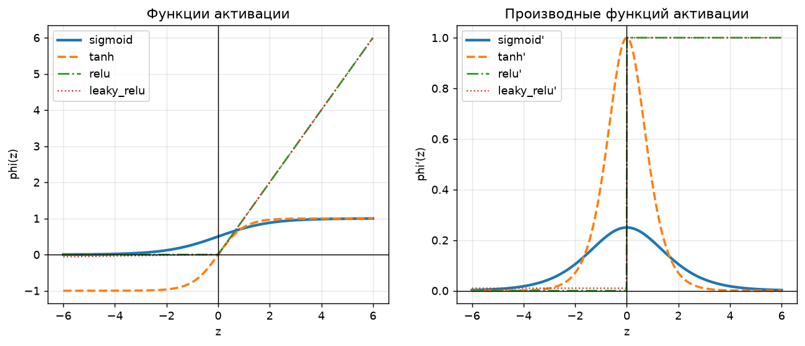
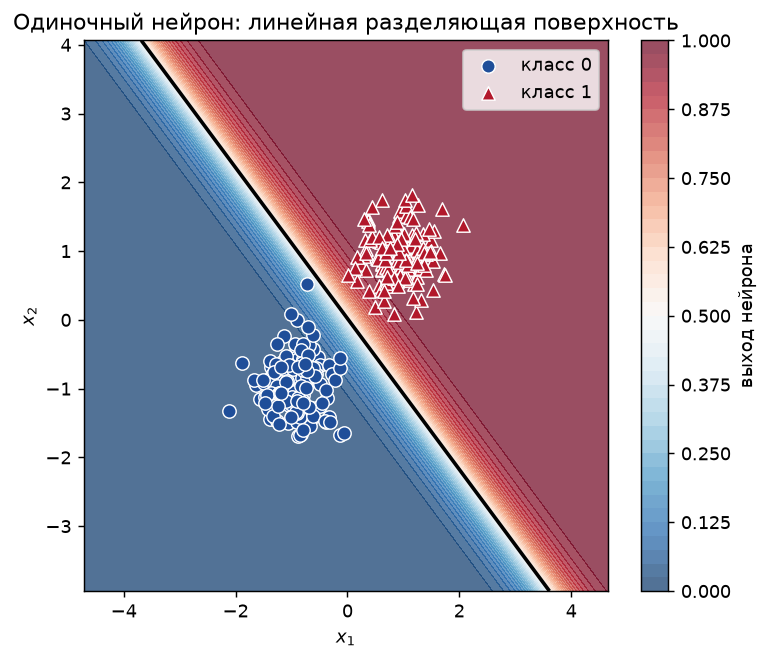
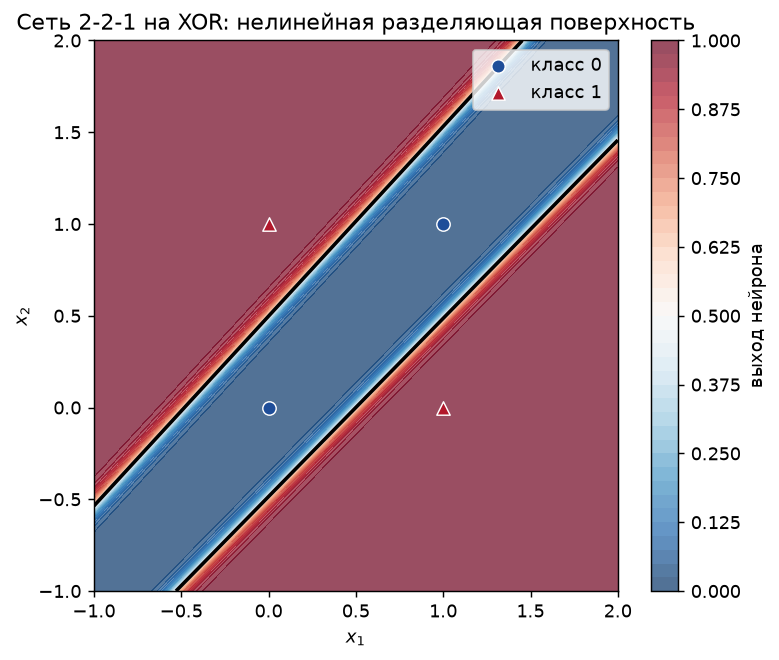
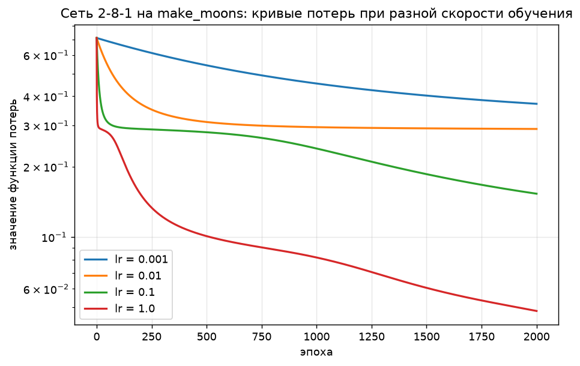

# Лабораторная работа № 1. Математические основы: нейрон на NumPy с нуля

**Неделя:** 1. **Объём:** 2 академических часа. **Форма контроля:** устный опрос.

**Цель работы.** Сформировать понимание внутреннего устройства искусственного нейрона:
реализовать прямой проход, функции активации, функцию потерь и аналитический градиент
средствами NumPy, **без использования фреймворков автоматического дифференцирования**.

Связь с содержанием дисциплины: лекция 1 «Введение в искусственные нейронные сети»;
СРОП 1 «Математика градиентного спуска и функции активации»;
СРО 1 «Эволюция архитектур ИИ: от перцептрона Розенблатта до трансформеров».

---

## 1. Структура проекта

```
lab1-kurator/
├── neuron/                       пакет с реализацией (только NumPy)
│   ├── activations.py            sigmoid, tanh, ReLU, LeakyReLU + производные
│   ├── losses.py                 MSE, BCE + градиенты dL/da
│   ├── neuron.py                 класс Neuron: forward, backward, fit
│   ├── mlp.py                    сеть D-H-1 с ручным обратным распространением
│   ├── datasets.py               XOR, AND-OR, make_moons, make_circles, make_blobs
│   ├── gradcheck.py              численная проверка градиента + диагностика изломов ReLU
│   ├── plotting.py               графики активаций, потерь и разделяющих поверхностей
│   └── variants.py               индивидуальные варианты по номеру в журнале
├── tasks/                        скрипты по пунктам хода работы
│   ├── task1_forward.py          пункт 1
│   ├── task2_activations.py      пункт 2
│   ├── task3_losses.py           пункт 3
│   ├── task4_train_linear.py     пункт 4
│   ├── task5_xor.py              пункт 5
│   ├── task6_gradcheck.py        пункт 6
│   ├── task7_learning_rate.py    пункт 7
│   ├── run_variant.py            индивидуальный вариант
│   └── run_all.py                все пункты подряд
├── web/                          веб-интерфейс для демонстрации
│   ├── artifact.html             страница: разметка, стили
│   ├── engine.js                 порт neuron/ на JavaScript
│   ├── app.js                    графики, карта решений, семь станций
│   ├── data.js                   наборы данных и эталон NumPy (генерируется)
│   ├── export_data.py            выгрузка данных и эталона из NumPy
│   └── server.py                 локальный запуск без зависимостей
├── notebooks/lab1_neuron.ipynb   отчёт в Jupyter (выполнен, с выводом и графиками)
├── tests/test_lab1.py            28 автотестов
└── figures/                      сохранённые графики
```

## 2. Запуск

```bash
pip install -r requirements.txt

python -m tasks.run_all                  # все семь пунктов подряд
python -m tasks.task5_xor                # отдельный пункт
python -m tasks.run_variant --table      # таблица вариантов
python -m tasks.run_variant -n 7         # свой вариант (номер в журнале)
python -m unittest discover -s tests -v  # автотесты
jupyter notebook notebooks/lab1_neuron.ipynb

python web/server.py --open              # веб-интерфейс, http://127.0.0.1:8000
```

Требуется Python 3.10+, NumPy, Matplotlib, scikit-learn (только для генерации данных).
Фреймворки глубокого обучения не используются.

---

## 3. Теоретическая часть

### 3.1 Модель нейрона

$$z = \mathbf{w}^\top \mathbf{x} + b, \qquad a = \varphi(z)$$

Для выборки $X \in \mathbb{R}^{N \times D}$: $\mathbf{z} = X\mathbf{w} + b$, $\mathbf{a} = \varphi(\mathbf{z})$.

### 3.2 Функции активации

| функция | $\varphi(z)$ | $\varphi'(z)$ | область значений | $\max \varphi'$ |
|---|---|---|---|---|
| sigmoid | $\dfrac{1}{1+e^{-z}}$ | $\varphi(z)\bigl(1-\varphi(z)\bigr)$ | $(0,1)$ | $0{,}25$ при $z=0$ |
| tanh | $\tanh z$ | $1-\tanh^2 z$ | $(-1,1)$ | $1$ при $z=0$ |
| ReLU | $\max(0,z)$ | $[z>0]$ | $[0,\infty)$ | $1$ при $z>0$ |
| LeakyReLU | $z$ при $z>0$, иначе $\alpha z$ | $1$ при $z>0$, иначе $\alpha$ | $\mathbb{R}$ | $1$ при $z>0$ |

Сигмоида вычисляется в численно устойчивой форме: при $z \ge 0$ используется
$1/(1+e^{-z})$, при $z < 0$ — $e^{z}/(1+e^{z})$, поэтому $e^{|z|}$ никогда не переполняется.

### 3.3 Функции потерь и их градиенты

**Среднеквадратичная ошибка**

$$L_{\text{MSE}} = \frac{1}{N}\sum_{i=1}^{N}(a_i - y_i)^2,
\qquad \frac{\partial L}{\partial a_i} = \frac{2(a_i - y_i)}{N}$$

**Бинарная кросс-энтропия**

$$L_{\text{BCE}} = -\frac{1}{N}\sum_{i=1}^{N}\Bigl[y_i \ln a_i + (1-y_i)\ln(1-a_i)\Bigr],
\qquad \frac{\partial L}{\partial a_i} = \frac{a_i - y_i}{N\,a_i(1-a_i)}$$

### 3.4 Градиент по параметрам нейрона

По правилу дифференцирования сложной функции:

$$\frac{\partial L}{\partial z_i} = \frac{\partial L}{\partial a_i}\,\varphi'(z_i),
\qquad
\frac{\partial L}{\partial \mathbf{w}} = X^\top \frac{\partial L}{\partial \mathbf{z}},
\qquad
\frac{\partial L}{\partial b} = \sum_{i=1}^{N} \frac{\partial L}{\partial z_i}$$

**Важный частный случай.** Для связки sigmoid + BCE

$$\frac{\partial L}{\partial z_i}
= \frac{a_i - y_i}{N\,a_i(1-a_i)} \cdot a_i(1-a_i)
= \frac{a_i - y_i}{N}$$

Множители сокращаются: градиент не затухает даже тогда, когда нейрон уверенно
ошибается. С MSE такого сокращения нет, остаётся множитель $\varphi'(z)$, и в зоне
насыщения сигмоиды обучение практически останавливается. Именно поэтому для
классификации предпочитают BCE. В коде эта свёрнутая форма используется явно
(`Neuron._output_delta`, `MLP.backward`) — она ещё и устойчивее численно.

### 3.5 Градиентный спуск

$$\mathbf{w} \leftarrow \mathbf{w} - \eta\,\frac{\partial L}{\partial \mathbf{w}},
\qquad b \leftarrow b - \eta\,\frac{\partial L}{\partial b}$$

Множитель $1/N$ включён в определение $L$, поэтому подобранный шаг $\eta$ не зависит
от размера выборки.

### 3.6 Обратное распространение для сети $D \to H \to 1$

Прямой проход:

$$Z_1 = X W_1 + \mathbf{b}_1,\quad A_1 = \varphi_1(Z_1),\quad
\mathbf{z}_2 = A_1\mathbf{w}_2 + b_2,\quad \mathbf{a}_2 = \varphi_2(\mathbf{z}_2)$$

Обратный проход:

$$\boldsymbol{\delta}^{(2)} = \frac{\partial L}{\partial \mathbf{a}_2} \odot \varphi_2'(\mathbf{z}_2)
\qquad
\frac{\partial L}{\partial \mathbf{w}_2} = A_1^\top \boldsymbol{\delta}^{(2)}
\qquad
\frac{\partial L}{\partial b_2} = \sum_i \delta^{(2)}_i$$

$$\Delta^{(1)} = \bigl(\boldsymbol{\delta}^{(2)} \otimes \mathbf{w}_2\bigr) \odot \varphi_1'(Z_1)
\qquad
\frac{\partial L}{\partial W_1} = X^\top \Delta^{(1)}
\qquad
\frac{\partial L}{\partial \mathbf{b}_1} = \sum_i \Delta^{(1)}_{i\cdot}$$

### 3.7 Численная проверка градиента

$$\frac{\partial L}{\partial \theta_k} \approx
\frac{L(\theta_k + \varepsilon) - L(\theta_k - \varepsilon)}{2\varepsilon}$$

Центральная разность имеет погрешность $O(\varepsilon^2)$ против $O(\varepsilon)$
у односторонней. При $\varepsilon = 10^{-5}$ и вычислениях в `float64` достигается
точность порядка $10^{-10}$. Сравнение ведётся по относительной ошибке

$$\text{rel} = \frac{|g_{\text{аналит}} - g_{\text{числ}}|}{\max(10^{-12},\,
|g_{\text{аналит}}| + |g_{\text{числ}}|)}$$

---

## 4. Результаты по пунктам хода работы

### Пункт 1. Класс `Neuron` с методом `forward`

`neuron/neuron.py`. Прямой проход совпадает с прямым расчётом по формуле
с точностью `0.000e+00` (побитово). Метод принимает как матрицу объектов,
так и один вектор; несоответствие размерности входа вызывает `ValueError`.

### Пункт 2. Активации, производные и графики на $[-6; 6]$

`neuron/activations.py`, график `figures/task2_activations.png`.
Все производные подтверждены центральной разностью:

| активация | max \|φ' − разностная\| |
|---|---|
| sigmoid | 1.116e-10 |
| tanh | 7.065e-11 |
| ReLU | 1.398e-10 |
| LeakyReLU | 1.398e-10 |



Наблюдения: сигмоида и tanh насыщаются — при $|z| > 4$ производная сигмоиды
меньше $0{,}02$, что приводит к затуханию градиента. ReLU не насыщается при
$z > 0$, но при $z < 0$ градиент строго нулевой («мёртвые» нейроны);
LeakyReLU оставляет $\varphi' = 0{,}01$ и снимает эту проблему.

### Пункт 3. MSE, BCE и аналитические градиенты

`neuron/losses.py`. Градиенты $\partial L/\partial a$ совпадают с конечными
разностями: MSE — `4.657e-12`, BCE — `1.633e-11`.
Тождество $\partial L/\partial z = (a-y)/N$ для sigmoid + BCE подтверждено
с расхождением `1.388e-17` (уровень машинного эпсилон).

### Пункт 4. Обучение на линейно разделимой задаче

`make_blobs`, 300 точек, sigmoid + BCE, $\eta = 0{,}5$, 400 эпох:

| | значение |
|---|---|
| потери до обучения | 0.695455 |
| потери после обучения | 0.007576 |
| точность | 1.0000 |
| разделяющая прямая | $3{,}5933\,x_1 + 3{,}2751\,x_2 - 0{,}0621 = 0$ |

Кривая потерь убывает строго монотонно (проверяется автотестом).
Контрольный пример — логическая функция OR — решается с точностью 100 %.



### Пункт 5. XOR и скрытый слой

**Одиночный нейрон не решает XOR.** Доказательство: нейрон задаёт предикат
$\operatorname{sign}(w_1x_1 + w_2x_2 + b)$, и XOR требует

$$b < 0,\qquad w_2 + b > 0,\qquad w_1 + b > 0,\qquad w_1 + w_2 + b < 0$$

Складывая второе и третье неравенства, получаем $w_1 + w_2 + 2b > 0$, откуда
$w_1 + w_2 + b > -b > 0$ — противоречие с четвёртым. Система несовместна.

Эксперимент (10 перезапусков, $\eta = 1{,}0$, 5000 эпох) даёт точность 0.50 во
всех запусках: минимум BCE достигается при $\mathbf{w} \to 0,\ b \to 0$, нейрон
выдаёт 0.5 на всех четырёх точках и потери равны $\ln 2 = 0{,}693147$. Прямая,
дающая 75 % верных ответов, существует, но она не является минимумом потерь.

**Сеть 2-2-1 решает XOR.** Обратное распространение реализовано вручную
(`MLP.backward`). Лучший из 10 запусков: потери `0.00125747`, точность `1.00`.

| $x$ | $y$ | выход сети |
|---|---|---|
| (0, 0) | 0 | 0.000917 |
| (0, 1) | 1 | 0.998340 |
| (1, 0) | 1 | 0.998345 |
| (1, 1) | 0 | 0.000794 |



Отдельный результат: минимальная сеть 2-2-1 сходится не всегда — 6 запусков из 10.
Неудачные застревают в локальном минимуме BCE $\approx 0{,}347$, где две
противоположные вершины квадрата классифицируются уверенно, а две оставшиеся
сеть оставляет ровно на границе ($a \approx 0{,}5$). Расширение скрытого слоя
убирает это плато:

| $H$ | решено запусков из 10 |
|---|---|
| 2 | 6 |
| 3 | 9 |
| 4 | 10 |
| 8 | 10 |

### Пункт 6. Численная проверка градиента

Требование задания: расхождение не более $10^{-6}$.

| конфигурация | max отн. ошибка | статус |
|---|---|---|
| Neuron sigmoid + MSE | 1.199e-11 | пройдено |
| Neuron sigmoid + BCE | 1.345e-11 | пройдено |
| Neuron tanh + MSE | 2.929e-11 | пройдено |
| Neuron ReLU + MSE | 3.127e-12 | пройдено |
| Neuron LeakyReLU + MSE | 4.076e-12 | пройдено |
| MLP 2-2-1 tanh/sigmoid + BCE (XOR) | 4.664e-09 | пройдено |
| MLP 2-2-1 tanh/tanh + MSE (XOR) | 5.848e-10 | пройдено |
| MLP 2-2-1 sigmoid/sigmoid + MSE (XOR) | 4.534e-09 | пройдено |
| MLP 2-4-1 ReLU/sigmoid + BCE (moons) | 2.147e-10 | пройдено |
| MLP 2-4-1 LeakyReLU/sigmoid + BCE (moons) | 2.683e-10 | пройдено |
| MLP 2-2-1 после 2000 эпох обучения | 5.830e-09 | пройдено |

**Наибольшая относительная ошибка: 5.830e-09** — на три порядка лучше требуемых $10^{-6}$.

**Отдельный случай: излом ReLU.** Смещения инициализируются нулём, а наборы XOR
и AND-OR содержат точку $(0,0)$, поэтому $z = 0$ **в точности**. В этой точке
производная ReLU не существует, конечная разность «перешагивает» излом, и
проверка даёт относительную ошибку `1.000e+00`. Это ограничение самого метода
конечных разностей, а не ошибка в выводе формул: после `randomize_params()`,
уводящей параметры от излома, та же проверка даёт `3.119e-11`.
Функция `kink_count()` обнаруживает такие точки автоматически.

### Пункт 7. Влияние скорости обучения

Одиночный нейрон, `make_blobs`, 500 эпох:

| $\eta$ | $L$ в конце | точность | эпоха достижения $L < 0{,}1$ | монотонность |
|---|---|---|---|---|
| 0.001 | 0.520919 | 1.0000 | не достигнут | да |
| 0.01 | 0.144325 | 1.0000 | не достигнут | да |
| 0.1 | 0.021953 | 1.0000 | 78 | да |
| 1.0 | 0.003873 | 1.0000 | 7 | да |

Сеть 2-8-1, `make_moons` ($n = 500$, шум 0.2), 2000 эпох:

| $\eta$ | $L$ в конце | точность |
|---|---|---|
| 0.001 | 0.371176 | 0.8640 |
| 0.01 | 0.289738 | 0.8640 |
| 0.1 | 0.153115 | 0.9560 |
| 1.0 | 0.048243 | 0.9800 |



**Граница устойчивости.** Для линейной активации и MSE функция потерь квадратична,
$H = \frac{2}{N}\tilde X^\top \tilde X$, и градиентный спуск сходится тогда и только
тогда, когда $\eta < 2/\lambda_{\max}(H)$. Для стандартизованного `make_blobs`
$\lambda_{\max} = 3{,}740265$, то есть критический шаг $0{,}534721$. Эксперимент
подтверждает границу точно:

| $\eta$ | доля от критического | $L$ после 200 эпох | режим |
|---|---|---|---|
| 0.1000 | 0.19 | 1.787e-02 | сходится |
| 0.4000 | 0.75 | 1.787e-02 | сходится |
| 0.5401 | 1.01 | 6.511e+02 | расходится |
| 0.6417 | 1.20 | 6.680e+57 | расходится |

Для сигмоидного нейрона такой жёсткой границы нет: при большом шаге активация
уходит в зону насыщения, градиент затухает, и обучение не взрывается,
а просто останавливается.

---

## 5. Индивидуальные варианты

Вариант определяется номером в журнале (`neuron/variants.py`):

```
activation_set = ACTIVATION_SETS[(N - 1) % 3]   # sigmoid+tanh / relu+leaky_relu / tanh+relu
task           = TASKS[(N - 1) % 4]             # xor / and_or / moons / circles
loss           = LOSSES[(N - 1) % 2]            # mse / bce
```

Периоды 3, 4 и 2 дают 12 различных сочетаний, повторяющихся с шагом 12.

| № | активации | задача | потери | скрытый слой | выход |
|---|---|---|---|---|---|
| 1 | sigmoid+tanh | xor | mse | sigmoid | tanh |
| 2 | relu+leaky_relu | and_or | bce | relu | sigmoid |
| 3 | tanh+relu | moons | mse | tanh | sigmoid |
| 4 | sigmoid+tanh | circles | bce | sigmoid | sigmoid |
| 5 | relu+leaky_relu | xor | mse | relu | sigmoid |
| 6 | tanh+relu | and_or | bce | tanh | sigmoid |
| 7 | sigmoid+tanh | moons | mse | sigmoid | tanh |
| 8 | relu+leaky_relu | circles | bce | relu | sigmoid |
| 9 | tanh+relu | xor | mse | tanh | sigmoid |
| 10 | sigmoid+tanh | and_or | bce | sigmoid | sigmoid |
| 11 | relu+leaky_relu | moons | mse | relu | sigmoid |
| **12** | **tanh+relu** | **circles** | **bce** | **tanh** | **sigmoid** |

Выходная активация выбирается согласованно с функцией потерь: BCE определена
только для $a \in (0,1)$, поэтому при `loss='bce'` выход всегда сигмоидный.
Для MSE с выходом tanh метки автоматически переводятся в $\{-1, +1\}$
(`datasets.targets_for`).

Запуск: `python -m tasks.run_variant -n <номер>`.

### Результаты варианта 12

`tanh + ReLU`, `make_circles`, BCE — скрытый слой `tanh`, выход `sigmoid`.

| | значение |
|---|---|
| одиночный нейрон | потери 0.693075, точность 49.6 % |
| сеть 2-8-1 (лучший из 5 запусков) | потери 0.022218, точность 99.6 % |
| проверка градиента | max отн. ошибка 1.320·10⁻⁹ — пройдено |
| η = 0.001 | потери 0.690674, точность 58.0 % |
| η = 0.01 | потери 0.597414, точность 78.0 % |
| η = 0.1 | потери 0.070114, точность 99.4 % |
| η = 1.0 | потери 0.015722, точность 99.8 % |

Одиночный нейрон на вложенных окружностях останавливается на `ln 2 ≈ 0.6931`:
минимум BCE для линейной модели достигается при `w → 0`, и нейрон выдаёт 0.5
на всей выборке. Скрытый слой снимает ограничение.

---

## 6. Веб-интерфейс

Для показа работы собрана интерактивная страница: она проводит по всем семи
пунктам хода работы, но вместо статических картинок даёт живые графики.

```bash
python web/server.py --open      # локально, без интернета и без зависимостей
```

Семь станций страницы повторяют ход работы:

| станция | что можно сделать |
|---|---|
| 01 | двигать `w₁, w₂, b, x₁, x₂` и видеть пошаговый расчёт `z` и `a` |
| 02 | график tanh и ReLU с производными на `[-6; 6]`, значения в выбранной точке |
| 03 | BCE и MSE как функции выхода, градиент `∂L/∂a` в выбранной точке |
| 04 | обучение одиночного нейрона на `make_circles` — упирается в `ln 2` |
| 05 | обучение сети `2-H-1` вживую: граница перестраивается по эпохам |
| 06 | проверка градиента текущей сети, включая разбор излома ReLU |
| 07 | сводный график кривых потерь для η = 0.001 / 0.01 / 0.1 / 1.0 |

На станции 05 переключаются набор данных (`circles`, `moons`, `XOR`, `AND-OR`),
активация скрытого слоя, ширина слоя `H`, скорость обучения и номер инициализации —
в том числе чтобы показать, как при `H = 2` часть запусков застревает в локальном
минимуме.

### Почему это не «вторая реализация»

Страница считает в браузере, но не является независимой работой:

* **данные те же.** `web/export_data.py` выгружает наборы из scikit-learn и
  стандартизует их тем же `neuron/datasets.py`. Координаты пишутся с полной
  точностью `float64`, без округления;
* **формулы те же.** `web/engine.js` — построчный порт `neuron/activations.py`,
  `neuron/losses.py`, `neuron/neuron.py` и `neuron/mlp.py`: тот же порядок
  параметров в плоском векторе, та же устойчивая форма сигмоиды, то же
  сокращение `∂L/∂z = (a − y)/N` для sigmoid + BCE;
* **совпадение проверяется.** В `data.js` лежит фикстура: 33 параметра сети и
  посчитанные NumPy значения потерь, прямого прохода и градиента. При загрузке
  страница считает то же самое и показывает расхождение в шапке.

| величина | расхождение JS и NumPy |
|---|---|
| функция потерь | 3.3·10⁻¹⁶ |
| прямой проход | 1.1·10⁻¹⁶ |
| градиент | 1.1·10⁻¹⁶ |

Это уровень машинного эпсилон `float64` — браузер и NumPy считают одно и то же.
Обновить фикстуру после правок в `neuron/` можно командой `python web/export_data.py`.

---

## 7. Автотесты

```
python -m unittest discover -s tests -v
...
Ran 28 tests in 4.2s
OK
```

Тесты покрывают: значения активаций и численную проверку их производных;
устойчивость сигмоиды при $|z| = 10^4$; значения и градиенты MSE и BCE;
соответствие `forward` формуле и обработку ошибочных размерностей;
проверку градиента для всех сочетаний активаций и потерь, в том числе после
обучения; восстановление параметров после численного дифференцирования;
обнаружение и устранение излома ReLU; решение линейно разделимой задачи,
монотонность убывания потерь, неразрешимость XOR одним нейроном и
разрешимость сетью 2-2-1; корректность таблицы вариантов.

---

## 8. Выводы

1. Нейрон сводится к двум операциям: аффинному преобразованию
   $z = \mathbf{w}^\top\mathbf{x} + b$ и поэлементной нелинейности $a = \varphi(z)$.
   Без нелинейности композиция слоёв остаётся линейной функцией.
2. Выбор активации определяет поведение градиента. Sigmoid и tanh насыщаются,
   ReLU не насыщается при $z > 0$, но обнуляет градиент при $z < 0$; LeakyReLU
   снимает проблему «мёртвых» нейронов ценой одного гиперпараметра $\alpha$.
3. BCE в паре с сигмоидой даёт $\partial L/\partial z = (a-y)/N$: градиент
   пропорционален ошибке и не затухает при уверенно неверном ответе. Это главный
   практический аргумент в пользу BCE против MSE в задачах классификации.
4. Одиночный нейрон реализует только линейный разделитель. Неразрешимость XOR —
   не свойство алгоритма обучения, а следствие несовместности системы неравенств.
5. Один скрытый слой из двух нейронов делает XOR разрешимым: скрытый слой строит
   новое представление, в котором классы линейно разделимы. При этом ландшафт
   потерь невыпуклый, и минимальная сеть 2-2-1 сходится лишь в 6 запусках из 10;
   расширение слоя до $H = 4$ даёт устойчивую сходимость.
6. Аналитические градиенты подтверждены конечными разностями с относительной
   ошибкой $\le 5{,}83\cdot10^{-9}$ во всех конфигурациях — требование $10^{-6}$
   выполнено с запасом в три порядка.
7. Скорость обучения задаёт компромисс между скоростью и устойчивостью. Для
   квадратичной задачи граница точная: $\eta < 2/\lambda_{\max}(H)$, что
   подтверждено численно. Практическое правило — брать наибольший шаг,
   при котором кривая потерь ещё убывает монотонно.

---

## 9. Контрольные вопросы к устному опросу

1. Запишите прямой проход нейрона. Зачем нужно смещение $b$?
2. Почему без нелинейной активации многослойная сеть эквивалентна одному слою?
3. Выведите $\varphi'(z)$ для сигмоиды через саму $\varphi(z)$.
4. Что такое затухание градиента и при каких $z$ оно возникает у сигмоиды?
5. В чём проблема «мёртвых» ReLU-нейронов и как её решает LeakyReLU?
6. Выведите $\partial L/\partial \mathbf{w}$ для MSE и для BCE.
7. Почему для sigmoid + BCE градиент упрощается до $(a-y)/N$ и чем это полезно?
8. Докажите, что одиночный нейрон не реализует XOR.
9. Запишите формулы обратного распространения для сети $D \to H \to 1$.
10. Зачем нужна численная проверка градиента и почему берут центральную разность?
11. Почему проверка градиента ненадёжна для ReLU и как это обойти?
12. Как выбрать скорость обучения? Что произойдёт при $\eta > 2/\lambda_{\max}(H)$?
13. Почему сеть 2-2-1 на XOR сходится не при каждой инициализации?
